# USB Passthrough Kit - Installation Guide

---
## Summary
This is the installation guide for the USB passthrough kit.  Please make sure that you follow all steps here!  If you run into any trouble and need more help please join the OpenStick [Discord](https://discord.gg/k2pxhke7q8).

This kit is primarily designed to work with the RP2040 Advanced Breakout Board although it can be used with most RP2040 devices as long as you have appropiate pins available.  If you do not have a RP2040 Advanced Breakout Board you can jump to THIS section where I go over install on a Raspberry Pi Pico.

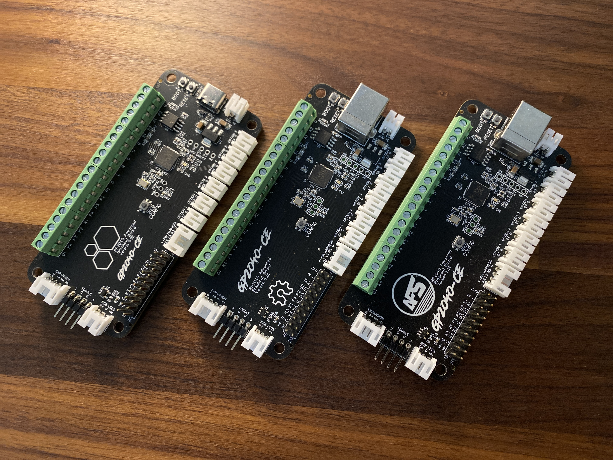

---
## Installation Guide

Workspace Setup:
Prepare a clean work surface and get your RP2040 ADvanced Breakout Board, USB passthough board and cables ready.

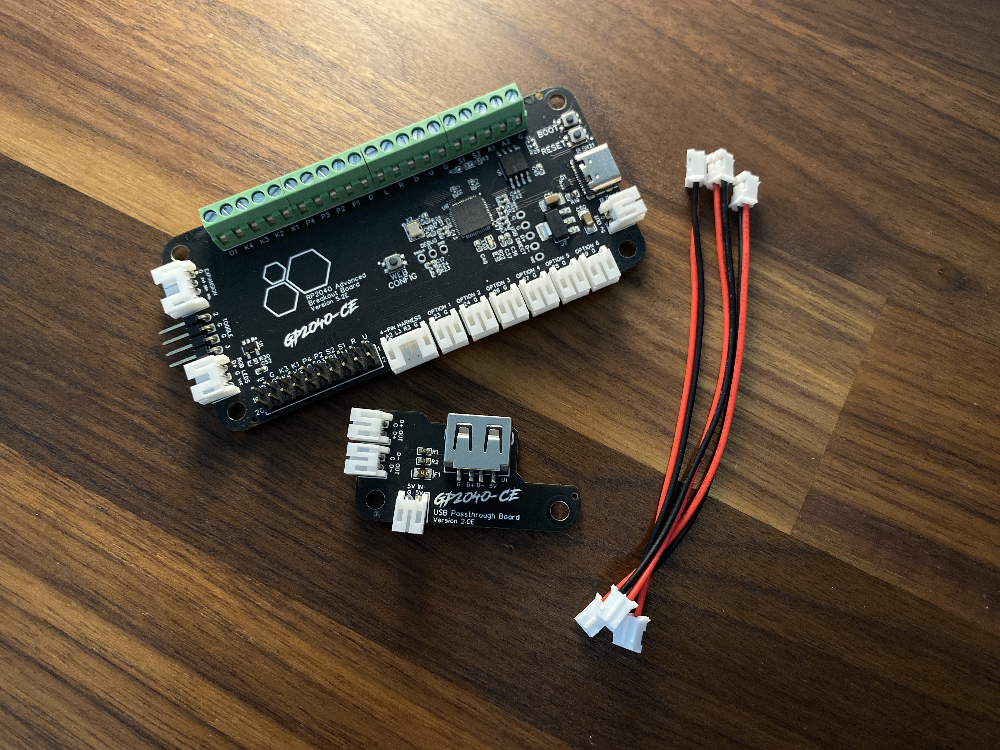

---

Step 1:

Take the USB passthough board and place it on a clean surface.

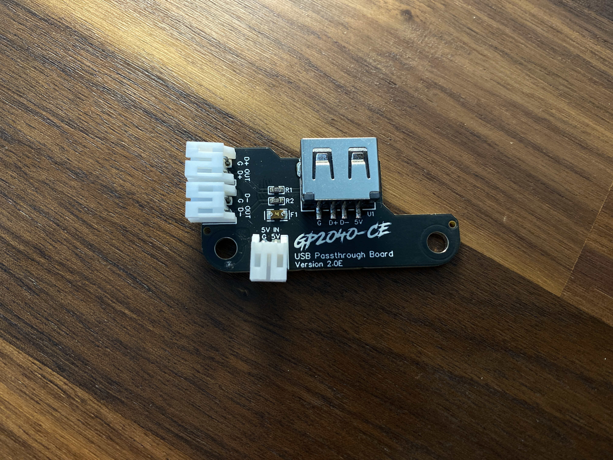

---

Step 2:

Take one of the cables and place it on a clean surface.

Note: The cables are JST 2.00mm 2pin same direction cables that are 10cm (100mm) in length.  They can be made by hand or purchased directly from a variety of sellers on AliExpress.  If you plan on installing the USB passthrough board somewhere else in your case you may want to get longer cables.  For this install guide you will need three of the cables.  

---

Step 3:

Connect one end of the first JST 2.00mm 2pin cable into the socket labeled `5V IN` on the USB passthrough board.

Note: The direction of the cable does not matter as they are all same direction cables.  

---

Step 4:

Connect the other end of the first JST 2.00mm 2pin cable to the socket labeled `5v OUT` on the RP2040 Advanced Breakout Board.

---

Step 5:

Connect one end of the second JST 2.00mm 2pin cable into the socket labeled `D+ OUT` on the USB passthrough board.

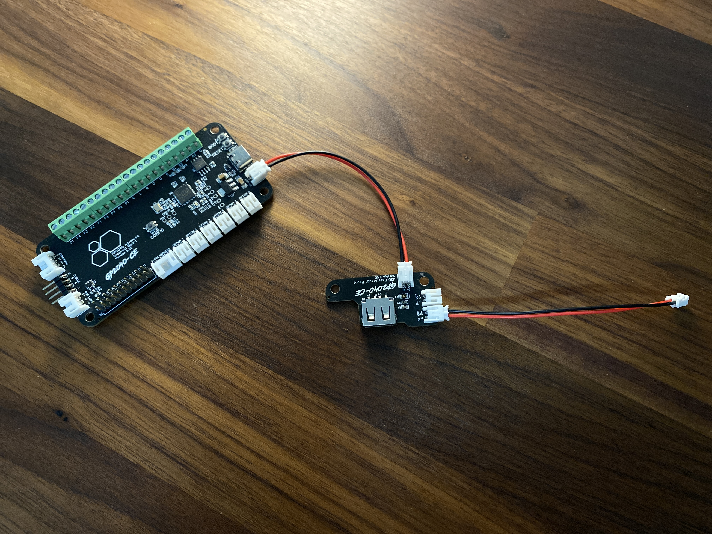

---

Step 6:

Connect the other end of the second JST 2.00mm 2pin cable to the socket labeled `OPTION 5` on the RP2040 Advanced Breakout Board.

Note: You can use other option sockets for this as well, but for the sake of this installation guide we will be using `Option 5` and `Option 6`. 

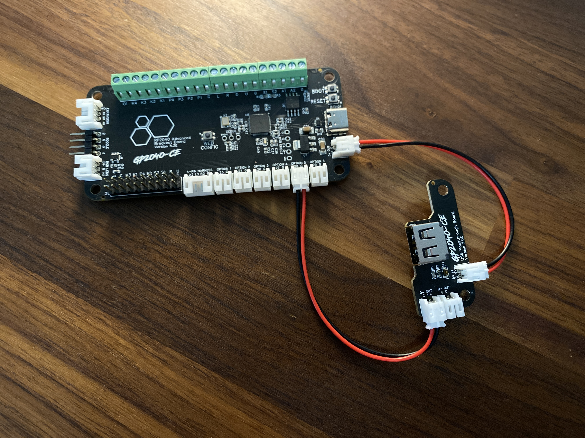

---

Step 7:

Connect one end of the third JST 2.00mm 2pin cable into the socket labeled `D- OUT` on the USB passthrough board.

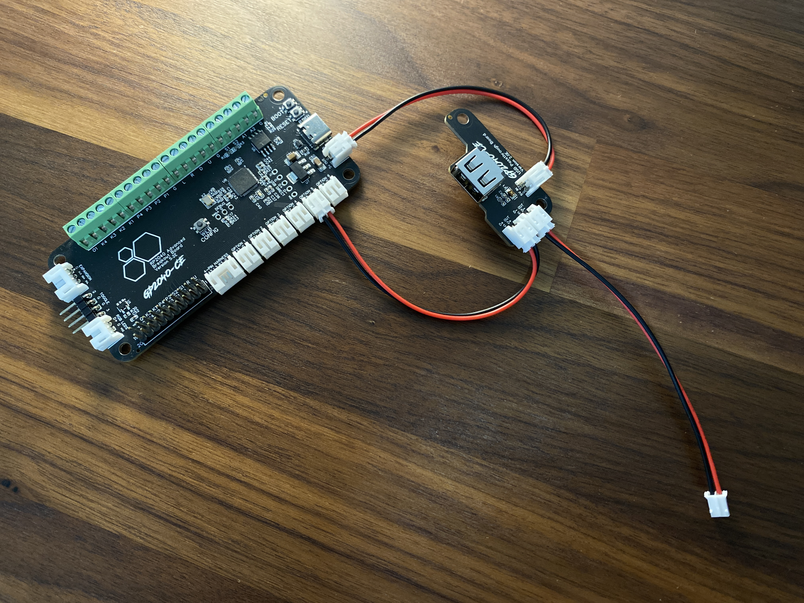

---

Step 8:

Connect the other end of the third JST 2.00mm 2pin cable to the socket labeled `OPTION 6` on the RP2040 Advanced Breakout Board.

Congratulations!  You have now connected the USB passthrough board to your RP2040 Advanced Breakout Board!

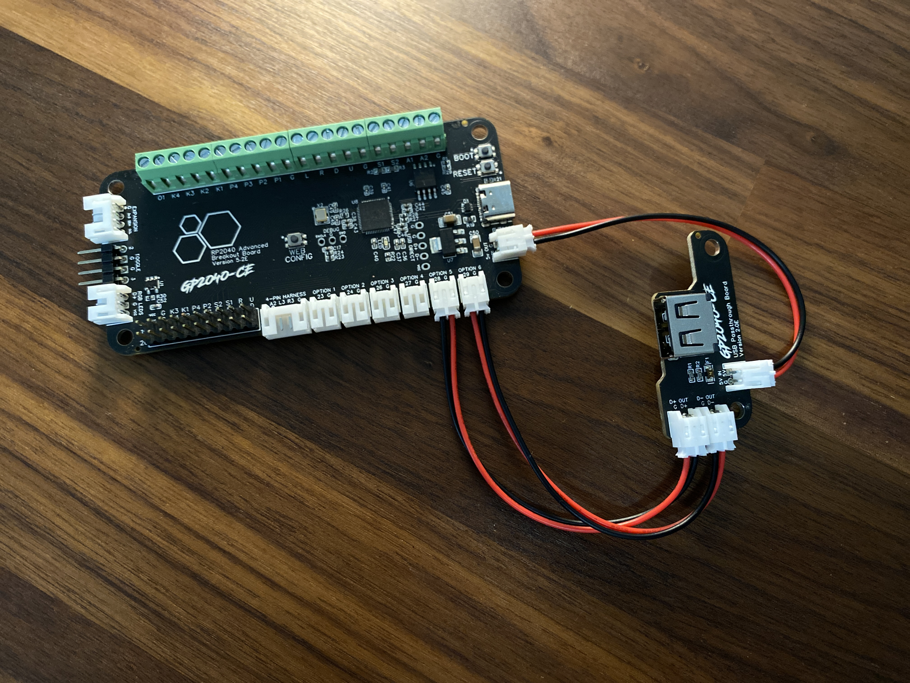

---

Firmware update and web-configuration:

In the following steps we will be updating the firmware on your RP2040 Advanced Breakout Board and then making the necessary changes to web-configuration get you up and running.  If you prefer to not play around in the web-configuration, I have created a special version of the firmware with all of the necessary changes already made which can be found [HERE](https://github.com/OpenStickCommunity/Hardware/blob/main/USB%20Passthrough%20Board/Vendor%20resources/Firmware/GP2040-CE_0.7.4_RP2040ADVANCEDBREAKOUTBOARD_USBPASSTHROUGH_ENABLED.uf2). 

If you download the linked file you can skip to Step 12.  Follow Step 12, skip Step 13 beacuse you have already downloaded the needed file and then follow Step 14.  Once that is finished you are setup and ready to go.

If you do not want to download the pre-compiled firmware please read on!

---

Step 9:

We will now connect the RP2040 Advanced Breakout Board to a computer to see what version of the firmware is currently on the board.  

Start by plugging a USB cable into the RP2040 Advanced Breakout Board.  

Note: Currently there are (officially) USB-C and USB-B versions of the RP2040 Advanced Breakout Board.  

---

Step 10:

While holding the button labeled `WEB CONFIG` on the RP2040 Advanced Breakout Board plug the other end of the USB cable into your computer.

Your RP2040 Advanced Breakout Board will now be in web-config mode.

---

Step 11:

Navigate to [192.168.7.1](192.168.7.1) in your web browser to access the web-configuration page.  

The web-configuration page will show you what version of the firmware you are currently running.  As you can see in the example screenshot here I am running v0.7.3 firmware on this RP2040 Advanced Breakout Board.  

For USB passthrough to work you need to be running at least v0.7.4.

Note: If you are already on v0.7.4 or later you can skip step 15.

---

Step 12:

In order to update the firmware on the RP2040 Advanced Breakout Board we will need to put the RP2040 Advanced Breakout Board in BootSel mode.

Unplug the RP2040 Advanced Breakout Board from your computer.

On your RP2040 Advanced Breakout Board in the top right you will see a button labeled `BOOT`.

Press and hold that button while connecting the device to your computer with a USB cable.

Your RP2040 Advanced Breakout Board will now be in BootSel mode.

You should see the RP2040 Advanced Breakout Board come up as a removable drive on your computer called `RPI-RP2`.

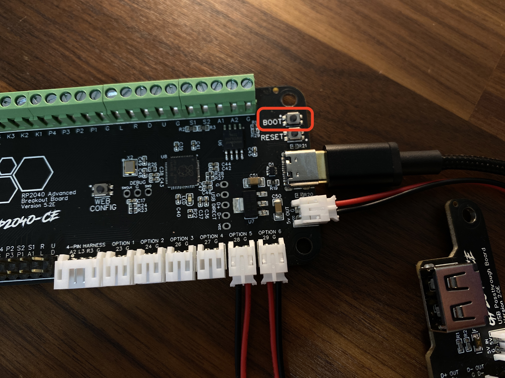

---

Step 13:

You will need to download the latest version of the firmware for the RP2040 Advanced Breakout Board.

There are several ways to get the firmware.  There is a direct link to the needed v0.7.8 firmware [HERE](https://github.com/OpenStickCommunity/GP2040-CE/releases/download/v0.7.4/GP2040-CE_0.7.8_RP2040AdvancedBreakoutBoard.uf2) or you can take a look at our downloads page [HERE](https://gp2040-ce.info/#/download) and download the needed .UF2 file for the RP2040 Advanced Breakout Board.

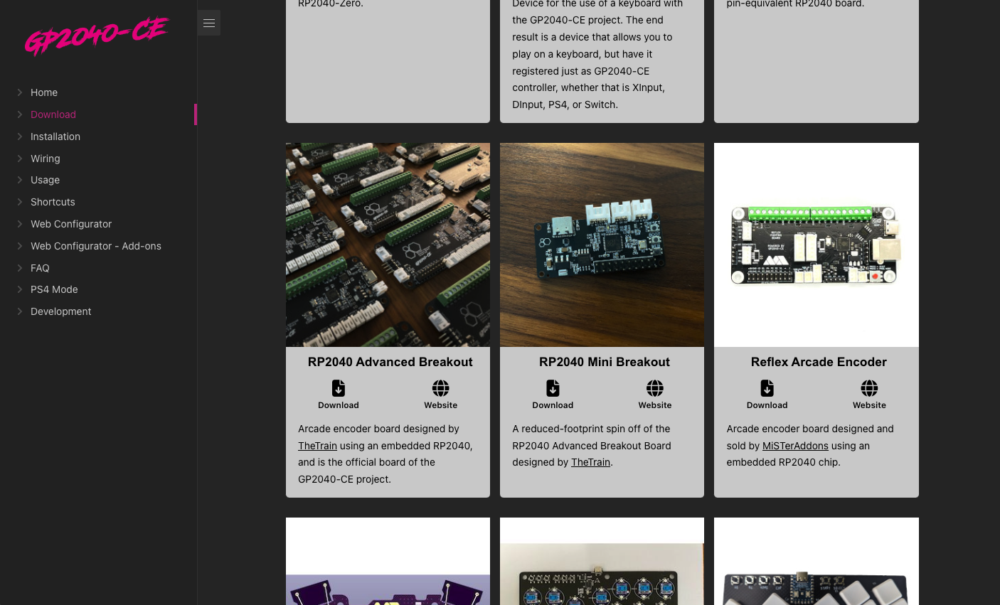

---

Step 14:

Once you have the v0.7.4 firmware file downloaded (it should be a .UF2 file) simply drag it and drop it onto the removable drive on your computer called `RPI-RP2`.

It will take a moment for the copy to complete.  Once it does you will see the device disconnect and then reconnect as a controller.

Congratulations!  You have updated the firmware on your RP2040 Advanced Breakout Board!

---

Quick Check:

Lets double check and make sure we are running a firmware of at least v0.7.4 now.

Navigate to [192.168.7.1](192.168.7.1) in your web browser to access the web-configuration page.  

As you can see in the example screenshot here I am now running v0.7.4 firmware on this RP2040 Advanced Breakout Board.  

---

Step 15:

We now need to setup the controller to work on a PS5 as a PS4 fightstick.

Since you are still in the web-config, click on the `Settings` tab.

From here click on the `Input Mode` drop-down and select `PS4`.  

When you do you will see two other options appear, one for switching the Touchpad andShare buttons around and another for setting the type of device you want the RP2040 Advanced Breakout Board to act as.

Since we want to use USB passthrough to allow the RP2040 Advanced Breakout Board to be used on the PS5 for games that support legacy PS4 fightsticks we need to change the `Controller` drop-down to `Arcade Stick`.

Once this is done scroll down to the bottom of the page and press the `Save` button.

---

Step 16:

The last thing we need to do in web-config is turn on USB passthrough.

From the `Configuration` tab click on `Add-Ons Configuration`.

This will take you to the main add-ons page.  

Scroll down here until you see the section called `PS Passthrough`.  

There is a little toggle switch on the right hand side, click it to turn PS Passthrough on.

Once this is turned on you will be able to set the `D+` pin that the USB passthrough board will use.  

In the `D+` box type in `28`.  You will see that `D-` is automatically set to `29`.

Once again, scroll down to the bottom of the page and press the `Save` button.

Note: The `D-` is set automatically and you do not need to set the `5V Power (optional)` pin for the RP2040 Advanced Breakout Board.

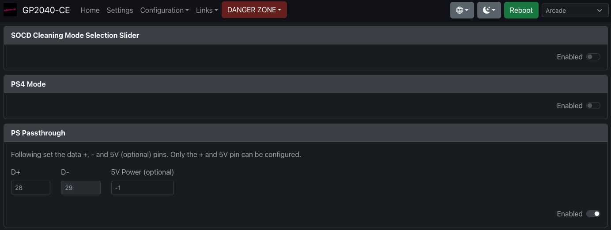

---

Step 17:

Once you have completed the above steps you can press the `Reboot` button in the top right.  

It will have a small popup asking if you want to reboot into `USB (BOOTSEL`, `Web-config` or `Controller`.

We are going to press the `Controller` button.

Once pressed the device will reboot and will show up as a controller on your computer.

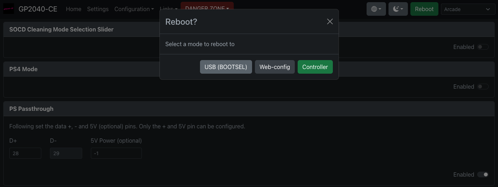

---

Step 18:

Step 18 is an optional step!

If you would like to attach your USB passthrough board to the RP2040 Advanced Breakout Board you can do so by using 2x 10mm (1cm) M3 standoffs and 4x 4mm M2 button-top bolts.

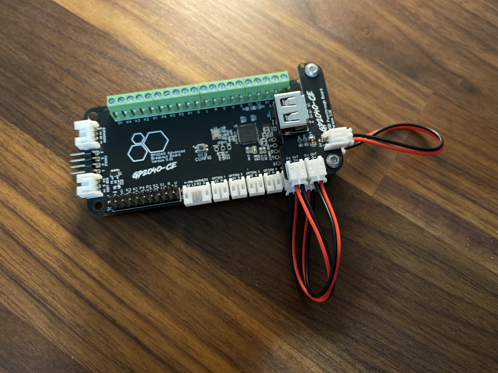

---

Step 19:

The final step is to connect the device you are planning to use to authenticate with to the USB passthrough board.  

In this example I am connecting a Mayflash MagicBoots v1.1 but you can also use another dongle like the PNX N5 or the board from any licensed 3rd party PS4 fightstick.  

Note: You cannot connect a DS5 or DS4 controller to the USB passthrough or any clone controllers.

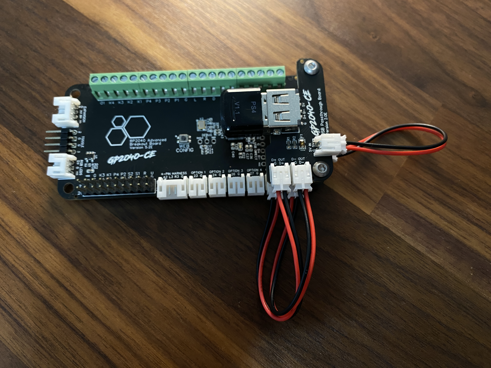

---

Congratulations!  

You have successfully updated your RP2040 Advanced Breakout Board, connected the USB passthrough board, made the necessary changes in web-config to get everything working and plugged in a device to authenticate with.

Go play some PS5 fighting games :)

